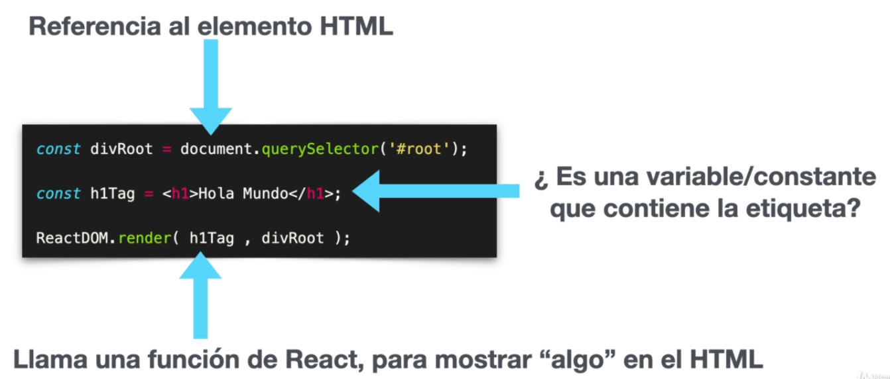

# Introducción a los conceptos básicos de React JS

**¿Qué es REACT?**

- Una libería para crear aplicaciones
- Declarativa
- Eficiente
- Predecible
- Componentes

- Server-sidee Node
- Aplicaciones móviles con React Native
- Aplicaciones de escriotrio con Electron

JSX = JS + XML




```js
  <!-- Carga React -->
   <script crossorigin src="https://unpkg.com/react@16/umd/react.production.min.js"></script>
   <script crossorigin src="https://unpkg.com/react-dom@16/umd/react-dom.production.min.js"></script>
   <script src="https://unpkg.com/babel-standalone@6/babel.min.js"></script>
```

```js
 <div id="root"></div>
  <script type="text/babel">

    const divRoot = document.querySelector('#root');
    const name = 'sofia'
    const h1Tag = <h1>hola mundo, { name } </h1>;

    ReactDOM.render(h1Tag, divRoot);

  </script>
```

**¿Qué es babel?**

Utiliza los últimos estándares de JS en cualquier navegador, sin preocuparnos en la compatibilidad.


