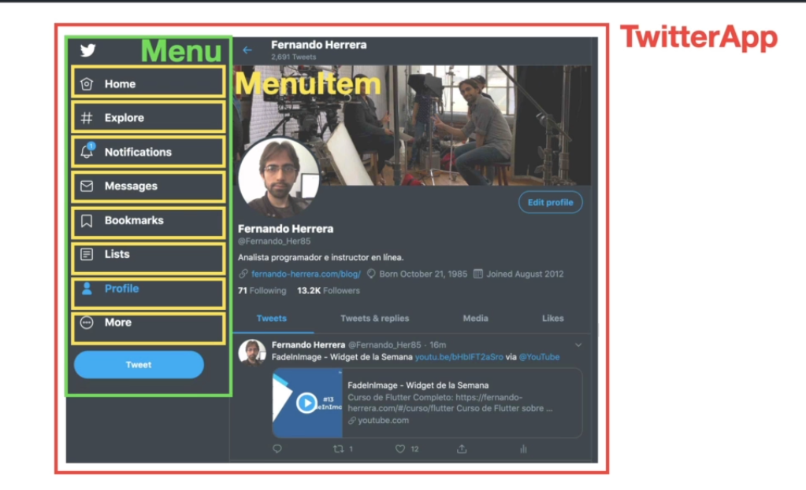

## ¿qué son los componentes?

Pequeña pieza de código encápsulada reutilizable que puede o no tener estado.

**Estado: cómo se encuentra la informacion del componente en un punto determinado del tiempo**

manifest.json has to do with pwd apps
robots.txt has nothing to do with react, it is for search