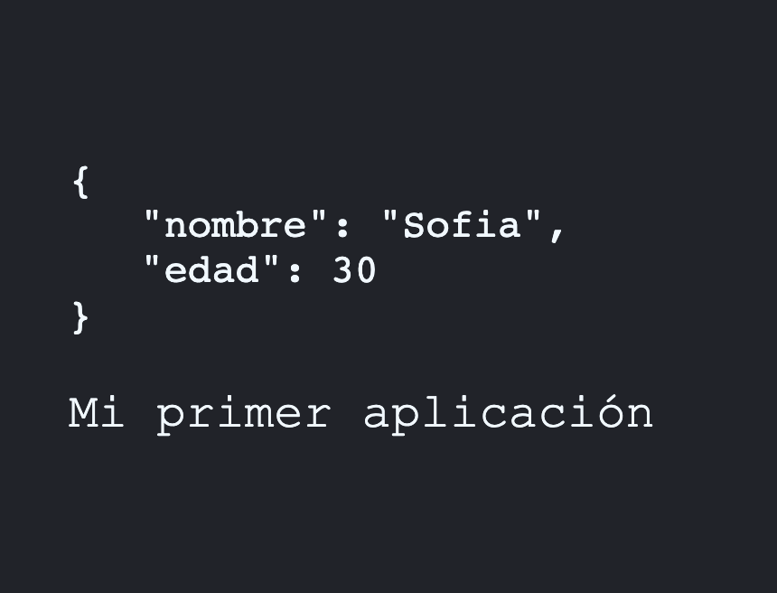

## ¿qué son los componentes?

Pequeña pieza de código encápsulada reutilizable que puede o no tener estado.


**Estado: cómo se encuentra la informacion del componente en un punto determinado del tiempo**

manifest.json has to do with pwd apps
robots.txt has nothing to do with react, it is for search

```js
import React from 'react';
import ReactDOM from 'react-dom';

const saludo = <h1>Hola Mundo</h1>;

console.log(saludo);

const divRoot = document.querySelector('#root');
console.log(divRoot);

// Dos argumentos jsx, dom
ReactDOM.render(saludo, divRoot);
```

**Dos tipos de componentes, basados en funciones y basados en classes**

## Functional components (antes Stateless Functional Components, antes no podían manejar el estado, con los hooks ahora sí se puede)

## Fragment

Si hay mas de un elemento en el return debe de haber un high order component

```js
// No funciona
const PrimeraApp = () =>{

  return 
    <h1>Hola Mundo desde mi primer componente</h1>
    <p>Fragment</p>
  
}
```
```js
// No funciona
const PrimeraApp = () =>{

  return (
    <h1>Hola Mundo desde mi primer componente</h1>
    <p>Fragment</p>
  );

}
```

**High order component**
```js
// Un div, sí aparece como parrte del html
const PrimeraApp = () =>{

  return (
    <div>
      <h1>Hola Mundo desde mi primer componente</h1>
      <p>Fragment</p>
    </div>
    
  );

}
```
```js
// Usar fragment, se debe importar
import React, { Fragment } from 'react';

const PrimeraApp = () =>{

  return (
    <Fragment>
      <h1>Hola Mundo desde mi primer componente</h1>
      <p>Fragment</p>
    </Fragment>
    
  );

}
```
```js
// Usar Fragment abreviado <> no necesita importación de librería
import React from 'react';

const PrimeraApp = () =>{

  return (
    <>
      <h1>Hola Mundo desde mi primer componente</h1>
      <p>Fragment</p>
    </>
    
  );

}
```

Dentro de las llaves cualquier expresión de JS que retorne un valor aunque no cualquier valor, por ejemplo: booleanos, objetos,
```js
<h1>{ saludo }</h1>
```
```js
// Así se imprimiría un objeto en la consola££
const PrimeraApp = () =>{
  const saludo = {
    nombre: 'Sofia',
    edaad: 30,
  }
  
  return (
    <>
      <pre>{ JSON.stringify( saludo, null, 3 ) }</pre>
      <p>Mi primer aplicación</p>
    </>
    
  );

}
```



```js
const PrimeraApp = ( props ) =>{

  console.log(props);
  return (
    <>
    <h1>{ props.saludo }</h1>
    </>
    
  );

}
```
**Ya no se acostumbra los props así ,ahora se usa destructuring:**
```js
const PrimeraApp = ({ saludo }) =>{

  return (
    <>
    <h1>{ saludo }</h1>
    </>
    
  );

}
```
```js
// Si no se envía un valor prop se puede establecer uno por default que lo estará cuando no haya dicho valor
const PrimeraApp = ({ saludo = 'Hola  mundo' }) =>{

  return (
    <>
    <h1>{ saludo }</h1>
    </>
    
  );

}
```

## Proptypes

Los porptypes ayudan a que se vuelva obligatorio o se especifique el tipo de prop que se ocupa en un componente
```js
const PrimeraApp = ({ saludo }) =>{

  return (
    <>
    <h1>{ saludo }</h1>
    </>
    
  );

}

// Defino las propiedades del componente
PrimeraApp.propTypes = {
  saludo: PropTypes.string.isRequired ,
  number: PropTypes.number
}
export default PrimeraApp;

```
Subtítulo no aparece en la consola, si en el dom, porque es un prop por default definido en el argumento

```js
const PrimeraApp = ({ saludo, subtitulo='default' }) 
```

```js
const PrimeraApp = ({ saludo, subtitulo }) =>{

  return (
    <>
    <h1>{ saludo }</h1>
    <p>{ subtitulo }</p>
    </>
    
  );

}

// Defino las propiedades del componente
PrimeraApp.propTypes = {
  saludo: PropTypes.string.isRequired ,
  number: PropTypes.number
}

// Valores por defecto, sí aparecen en la consola
PrimeraApp.defaultProps ={
  subtitulo: 'Soy un subtitulo'
}
export default PrimeraApp;
```

## Events on React

```js
<button onClick={ (e) => { console.log(e) }}>+1</button>
```

```js
const CounterApp = ({ value }) => {
  // handleAddEvent
  const handleAdd = (e) =>{
    console.log(e)
  }
  return (
    <>
      <h1>CounterApp</h1>
      <h2>{ value }</h2>

      <button onClick={ handleAdd }>+1</button>
    </>
  )
};
```

## Hooks
```js
  // useState = [valor, function]
  const state = useState('Goku');
  // we are accesign to the function in useState funtion
  console.log(state[1]());
  const [nombre, setNombre] = useState('goku');
  console.log(nombre, setNombre);
```

```js
  const CounterApp = ({ value }) => {

  const [ counter, setCounter ] = useState( 0 );

  const handleAdd = (e) =>{
    setCounter( counter + 1);
  }
  return (
    <>
      <h1>CounterApp</h1>
      <h2>{ counter }</h2>
      <button onClick={ handleAdd }>+1</button>
    </>
  )
};
```